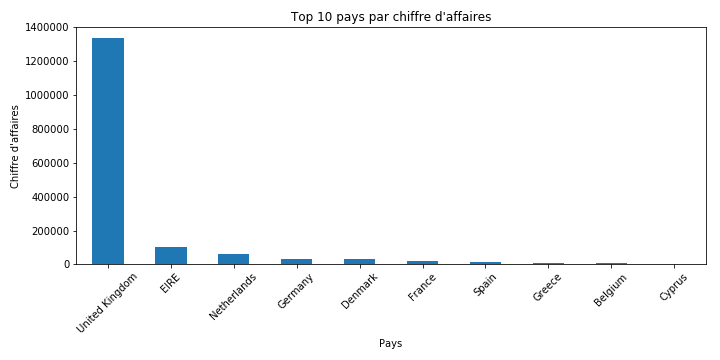

# E-commerce Data Analysis

## Objectif

Analyser les ventes d’un dataset e-commerce afin d’identifier des tendances et des insights business exploitables.

---

## Dataset

* Source : Online Retail Dataset (UCI)
* Période : 2009 - 2010
* Données : transactions e-commerce (produits, clients, pays, prix, quantités)

---

## Outils utilisés

* Python
* Pandas
* Matplotlib
* Jupyter Notebook

---

## Étapes de l’analyse

### 1. Data Loading

Chargement d’un échantillon du dataset pour optimiser les performances.

### 2. Data Cleaning

* Suppression des valeurs manquantes
* Filtrage des quantités et prix négatifs
* Nettoyage des colonnes

### 3. Feature Engineering

* Création de la variable `TotalPrice` (chiffre d’affaires)

### 4. Data Analysis

* Analyse du chiffre d’affaires global
* Analyse par pays
* Analyse des produits les plus vendus
* Analyse temporelle des ventes

---

## Résultats clés

* 💰 Chiffre d’affaires total : **1,63M**
* 🌍 Le Royaume-Uni représente plus de **80% des ventes**
* 📦 Les ventes reposent sur des produits à **faible coût mais à forte rotation**
* 📅 Activité fortement **saisonnière** avec un pic en fin d’année

---

## Insights business

* Forte dépendance à un marché unique (Royaume-Uni)
* Stratégie commerciale orientée volume
* Opportunité d’optimisation marketing sur les périodes clés (Noël)

---

## Visualisation

 Graphique : Top 10 pays par chiffre d’affaires

---

## Améliorations possibles

* Segmentation client (RFM)
* Modélisation prédictive (Machine Learning)
* Dashboard interactif (Power BI / Tableau)

---

## Projet

Notebook complet disponible ici :
[ecommerce_analysis.ipynb](./ecommerce_analysis.ipynb)

---

## Auteur

* Nom : *[AMAGBEGNON GENEVIEVE]*
* LinkedIn : *[www.linkedin.com/in/genevieveamagbegnon]*
* GitHub : *[(https://github.com/Ifayemi19)]*
